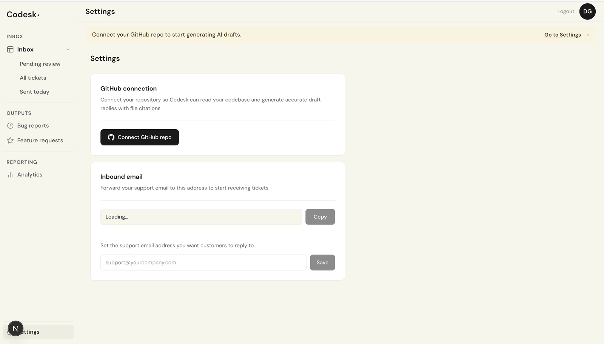
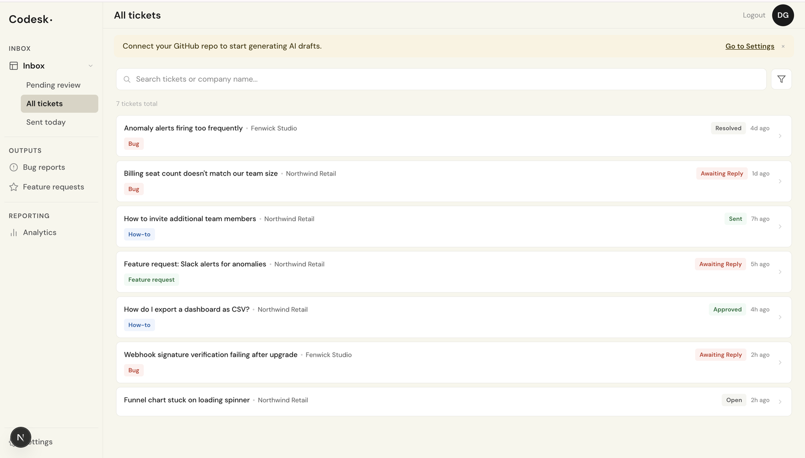
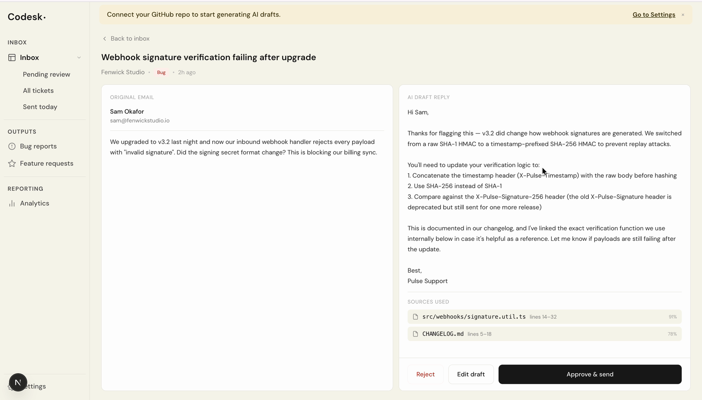
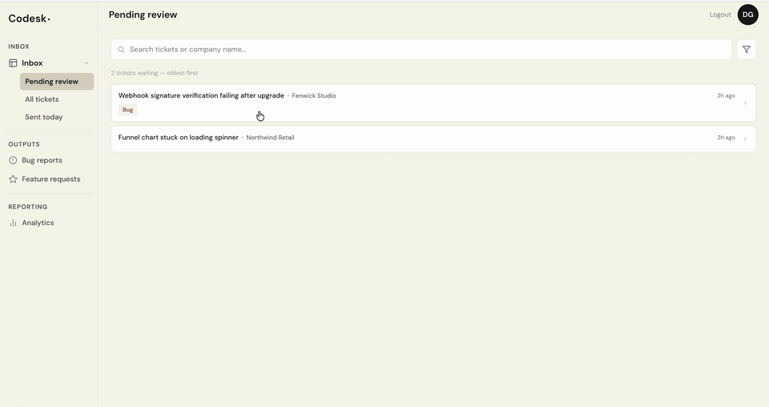
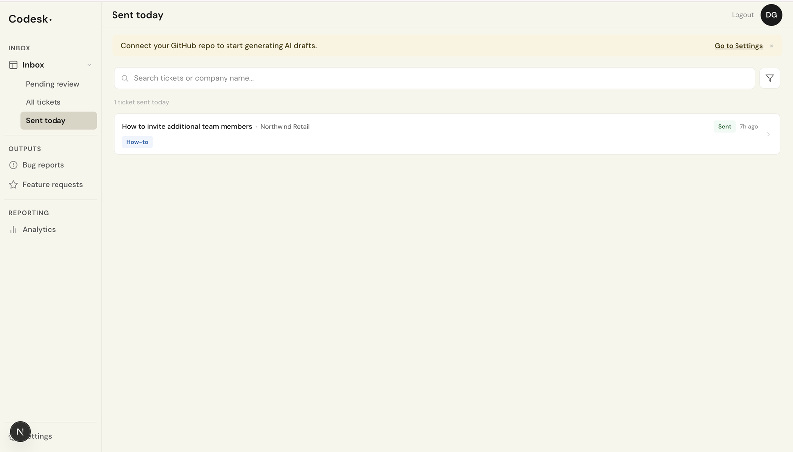
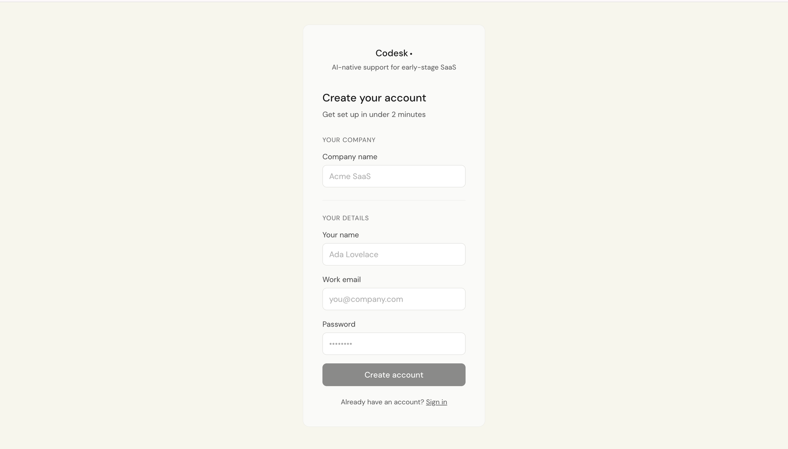
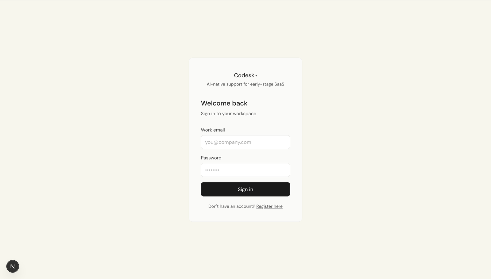

# Codesk

**AI-native helpdesk for early-stage B2B SaaS.** One person runs customer
support for an entire company — Codesk drafts every reply, a human approves
it, nothing goes out without sign-off.

Screens below are from the running app, using a demo workspace with
seeded, fictional customers.

---

## The problem

Support at an early-stage SaaS company is repetitive in a way that's hard to
template: the same handful of question types, answered by digging through
your own codebase and docs every time. A generic AI chatbot can't do this —
it doesn't know your product. Codesk is built specifically to read *your*
codebase and docs, so the drafts it writes are grounded in what your product
actually does.

## How it works

### 1. Connect your GitHub repo

Read-only OAuth. Codesk ingests and chunks your codebase and docs into a
searchable knowledge base. The same settings page gives you an inbound
address to forward your support email to, and lets you set the reply-to
address customers see.

### 2. A customer emails support

An inbound webhook turns each email into a ticket automatically — no manual
entry. Every ticket is classified by type (bug, how-to, feature request) and
tracked by status, so the inbox shows what needs attention at a glance.

### 3. Codesk drafts a reply

The ticket is embedded, matched against your codebase via vector similarity
search, and handed to Claude to draft a reply grounded in what it found.
Every draft lists the exact source files and line ranges it drew on, with a
match score for each, so the reviewer can check the answer against the code
instead of taking it on trust.

### 4. A human reviews it

The original email and the AI draft sit side by side. **Approve & send**,
**Edit draft**, or **Reject** — one click each. Tickets that shouldn't get
an AI answer can be handled with a plain manual reply instead.

### 5. The reply sends

Only after approval. Tickets move through a clear lifecycle — open, pending
review, approved, sent, resolved — so nothing falls through the cracks, and
**Sent today** shows everything that went out.

> **Nothing sends without a human in the loop. That's a permanent design
> constraint, not a v1 limitation.**

Sign-up and sign-in

 

A workspace is one form: company name, your name, work email, password.

<table>
  <tr>
    <td></td>
    <td></td>
  </tr>
</table>

## Under the hood

| Layer | Stack |
|---|---|
| Backend | NestJS · Prisma 6 · PostgreSQL 16 + pgvector |
| Frontend | Next.js 15 (App Router) · Tailwind |
| AI drafting | Claude Sonnet |
| Retrieval | OpenAI `text-embedding-3-small`, vector similarity search over ingested code + docs |
| Async processing | BullMQ + Redis |
| Email | Postmark (inbound parsing + outbound sending) |
| Auth | Server-side sessions (Postgres-backed, not JWT), per-tenant isolation enforced at the query layer |

Multi-tenant from the ground up — every table is scoped by tenant first, not
derived through joins, so one customer's data is never reachable from
another's session.

## Who it's for

- Founders doing their own customer support at 2–8 person teams
- Solo CS hires drowning in ticket volume at Series A companies

## Pricing

| Plan | Price |
|---|---|
| Starter | $149/mo |
| Growth | $399/mo |
| Scale | Custom |

## Status

In active development. Currently onboarding early customers before opening
up more broadly.

## Interested?

The codebase is private while we build with early customers — this repo is
just the front door. If you want early access, a demo, or want to talk about
how it's built, reach out:

**darshithagongle@gmail.com**
