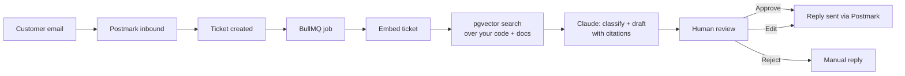

# Codesk

**AI-native helpdesk for early-stage B2B SaaS.** Codesk reads your codebase
and docs, drafts a reply to every support ticket, and shows you exactly which
files it used. You review, edit if needed, and approve. One person can run
support for the whole company.

Screens below are from the running app, using a demo workspace for a
fictional company ("Pulse") with seeded, fictional customers. Development-mode
overlays were cropped out.

---

## The problem

Support at an early-stage SaaS company is repetitive in a way that's hard to
template: the same handful of question types, answered by digging through
your own code and docs every time. A generic AI chatbot can't do this,
because it doesn't know your product. Codesk is built to read *your*
codebase, so its drafts are grounded in what your product actually does, and
every draft shows its sources so you can check it in seconds.

## How it works

### 1. Connect your GitHub repo

Codesk crawls the repository and splits it into a searchable knowledge base:
source code, markdown docs, and GitHub Issues. Code is split along real
boundaries (functions, classes) using tree-sitter, not cut into fixed-size
blocks, so each chunk is a piece of code that makes sense on its own.

The same page gives you an inbound address like
`yourcompany@inbound.codesk.com`. Forward your existing support inbox to it
and you're done. No DNS or MX changes. You also set the reply-to address
customers see.

### 2. A customer emails support

Each forwarded email becomes a ticket automatically. Drafting runs in a
background queue, so intake stays fast and a slow model call never drops an
email.

### 3. Codesk drafts a reply

The ticket is embedded and matched against your knowledge base with vector
similarity search. The closest chunks go to Claude, which does two things:

- **Classifies the ticket** (bug, how-to, feature request). This happens
  *after* retrieval, so the classification is informed by your actual code,
  not just the wording of the email.
- **Drafts the reply**, citing the exact files and line ranges it drew on.

Each source shows a match score (how closely that chunk matched the ticket),
so a weak or missing source is visible before anything goes out.

### 4. A human reviews it

The original email and the draft sit side by side. **Approve & send**,
**Edit draft**, or **Reject**, one click each. Tickets that shouldn't get an
AI answer can be handled with a plain manual reply.

### 5. The reply sends

Only after approval. Every ticket moves through one lifecycle:

| Status | Meaning |
|---|---|
| **Open** | New ticket, no draft yet |
| **Awaiting Reply** | Draft is ready and waiting for your review |
| **Approved** | You approved the draft |
| **Sent** | Reply delivered to the customer |
| **Resolved** | Closed |

**Pending review** collects everything that needs you, and **Sent today**
shows everything that went out.

> **Human approval is the default.** Nothing sends without sign-off today.
> Automation expands only when you choose to turn it up, one ticket type at a
> time, as the drafts earn your trust.

Sign-up and sign-in

 

A workspace is one form: company name, your name, work email, password.

<table>
  <tr>
    <td></td>
    <td></td>
  </tr>
</table>

## Security and your code

Giving a tool access to your codebase is a real decision, so here is
exactly what happens:

- **Codesk only reads your repository.** It doesn't commit, push, or open
  pull requests.
- **Your GitHub token is encrypted at rest** (AES-256-GCM).
- **What leaves your repo:** code and doc chunks are sent to OpenAI to create
  embeddings, and the chunks relevant to a ticket are sent to Anthropic
  (Claude) to write the draft. Under their standard API terms, neither
  provider trains on this data.
- **Tenant isolation:** every table is scoped by tenant ID first, and every
  query, including the vector search, filters on it. One workspace's code
  and tickets are never searched on behalf of another.
- **Sessions:** server-side sessions stored in Postgres with httpOnly
  cookies, not JWTs in the browser.
- **Deletion:** email us and we'll delete your workspace, its index, and its
  tickets.

**Can't send code to a cloud service at all?** We're designing a
self-hosted mode where indexing and search run inside your own environment
and only the minimum context needed for a draft leaves it. If that's you,
we'd like to talk.

## Under the hood

| Layer | Stack |
|---|---|
| Backend | NestJS · Prisma 6 · PostgreSQL 16 + pgvector |
| Frontend | Next.js 15 (App Router) · Tailwind |
| AI drafting + classification | Claude Sonnet |
| Retrieval | OpenAI `text-embedding-3-small` · pgvector similarity search · tree-sitter code chunking |
| Async processing | BullMQ + Redis |
| Email | Postmark (inbound parsing + outbound sending) |
| Auth | Server-side sessions (Postgres-backed, not JWT) |

A few design choices that matter for where this is going:

- **The AI's original draft is never overwritten.** Each draft stores the
  model's original text and the final text you approved separately. Your
  edits become the training signal that makes future drafts better.
- **Citations are first-class data**, stored in their own table and
  versioned when a draft is regenerated, so the sources shown always match
  the draft you're reading.

## What's built and what's next

**Working today:** GitHub ingestion · email intake by forwarding · ticket
classification · cited draft replies · review, edit and approve · reply
sending · ticket lifecycle and inbox views.

**Next:**
- Automatic re-indexing on every push (today the repo is indexed when you
  connect it)
- Low-confidence flagging when retrieval finds nothing strong
- Bug reports and feature-request views (already in the sidebar) that group
  related tickets
- Suggested fix PRs generated from bug tickets, always reviewed by a human
- Self-hosted mode for teams that can't share code with a cloud service

## Who it's for

- Founders doing their own customer support at 2–8 person teams
- Solo support hires drowning in ticket volume at Series A companies

## Pricing (planned)

| Plan | Price |
|---|---|
| Starter | $149/mo |
| Growth | $399/mo |
| Scale | Custom |

Early design partners get founder pricing.

## Team

- **Chetan** (backend)
- **Darshitha** (product and frontend)

## Interested?

We're looking for our first design partners: early-stage B2B SaaS teams
where one or two people handle all of support. The codebase is private while
we build. This repo is the front door.

For early access, a live demo on your own repo, or to talk about how it's
built:

**darshithagongle@gmail.com**
